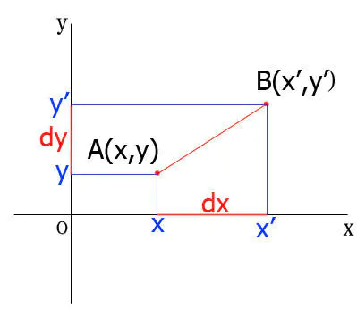

# 关于canvas大小的思考：

我们给canvas设置大小的时候`canvas.width = 500`,本就应该察觉：canvas的大小单位并不是`px`，而是一个canvas独立的大小值，只是碰巧，这个值与`px`的换算关系是`1:1`。我们在canvas上进行绘制的时候，一般的绘制方法也都是前两个参数先定位，后两个参数指定大小，比如`ctx.fillRect(x, y, width, height)`，其实这里并不是省略了单位`px`，而是本身用的度量单位就是canvas独立大小单位。且默认状态canvas独立单位与`px`1:1进行换算。

## 缩放变换`scale(sx, sy)`

`scale(sx, sy)`的意思就是指x方向1个canvas独立单位顶`sx`个`px`（1个canvas独立单位需要`sx`个`px`进行绘制）,y方向同理。默认条件下，canvas独立单位与`px`1：1进行换算就是因为scale的默认状态就是`scale(1, 1)`。`ctx.scale(2, 2)`之后，原本(100, 100)跑到了变换前(200, 200)的位置：因为canvas默认坐标原点在左上角（向下为y，向右为x）。现在需要2个px才顶canvas上的1个单位长度，（参照周围的dom元素大小），以前100，100的点，canvas坐标还是100，100，但是从canvas左上角为了到达这个100，100，我们需要向下向右各走200px。

# 矩阵变换`transform(a, b, c, d, e, f)`

记初始状态（canvas独立单位与`px`1：1的状态）为源状态。源状态下canvas的坐标矩阵是三行一列：`(1x, 1y, 1z)`，这个矩阵代表当前的canvas与源状态坐标关系：现在的x坐标等价于源状态的`1x`，y、z同理**（如果canvas当前的坐标矩阵为三行一列：`(2x+1, y, z)`，那就代表当前canvas的点的x值为源状态canvas中x的2倍加1）**。

如何获得当前canvas的坐标矩阵：那就是用下面的矩阵（记为变换矩阵）与三行一列的源矩阵`(x, y, z)`相乘。之所以canvas的初始时默认的源坐标矩阵为`(x, y, z)`就是因为下面的变换矩阵初始时默认a=1,b=0,c=0,d=1,e=0,f=0，**变换矩阵初始为单位矩阵**。我们`transform`的六个参数就是指变换矩阵的前两行。

因为`transform`方法是针对平面`2dcanvas`的，所以自然和z轴坐标没什么关系，自然`transform`不修改变换矩阵第三行的参数（变换矩阵第三行与坐标矩阵相乘得z），六个参数对应变换矩阵的前两行。（变换矩阵前两行与坐标矩阵相乘得x、y）。

## transform完成平移变换

如上图所示： `x’ = x + dx`， `y’ = y + dy`。

也即是说可以使用 `context.transform (1,0,0,1,dx,dy)`代替`context.translate(dx,dy)`。

## transform完成缩放变换

同理可以使用 `context.transform(sx,0,0,sy,0,0)`代替`context.scale(sx, sy)`;

解释： `context.transform(sx,0,0,sy,0,0)`执行后canvas的坐标矩阵的第一行为`sx*x`也就是说现在的x坐标为源矩阵中`x`的`sx`倍。自然现在canvas上x方向上的某点比变换之前远，是以前的`sx`倍。

## transform完成旋转变换

如上图图所示：

B点是通过A点逆时针旋转θ得到，
 `x = r * cosa`，
 `y = r * sina`

即
 `x’=r*cos(a+θ)=x*cosθ-y*sinθ`，
 `y’=r*sin(a+θ)=x*sinθ+y*cosθ`

也即是

综上：
 `context.transform(Math.cos(θ*Math.PI/180)，Math.sin(θ*Math.PI/180), -Math.sin(θ*Math.PI/180),Math.cos(θ*Math.PI/180)，0，0）`可以替代`context.rotate(θ)`。

# 矩阵变换setTransform方法

 `rotate()`、`scale()`、 `translate()`、 `transform()`对于变换矩阵的修改是基于曾经的这四个方法修改完的坐标矩阵为源矩阵进行的。而`setTransform`方法修改变换矩阵时会把坐标矩阵重置为三行一列`(x, y, z)`。

参考资料：[矩阵变换 · CANVAS——Draw on the Web (gitbooks.io)](https://airingursb.gitbooks.io/canvas/content/16.html)